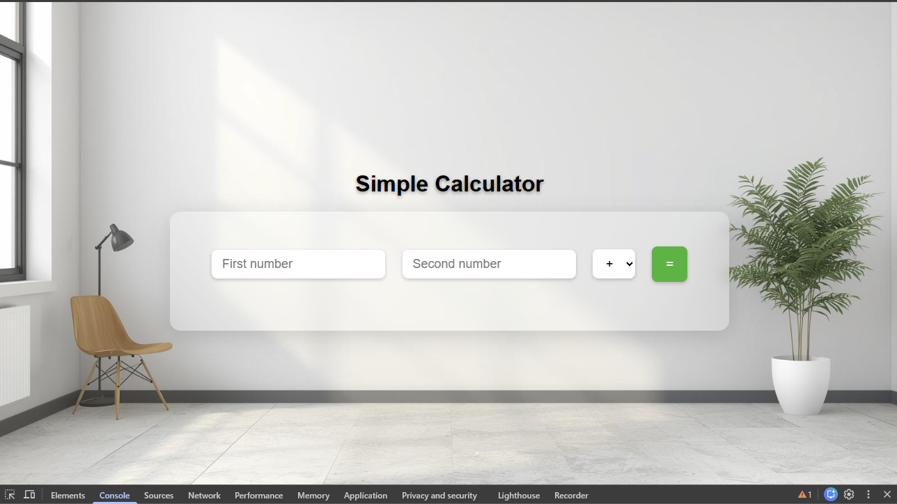

# 🧮 Full Stack Calculator | Foundations Practice (FastAPI + JavaScript)

This project is part of my **Full Stack Lab** — a collection of small, focused builds across my tech stack.  
Each project reinforces a different foundation before scaling up to larger systems.  

---

##  Project Purpose

This calculator was built to **revisit and strengthen my fundamentals** across both backend and frontend:
-  **Python / FastAPI** → reinforcing function logic, modularization, and API creation  
-  **JavaScript / DOM** → practicing frontend event handling and async API communication  
-  **Testing** → implementing proper **unit tests** and **integration tests** with `pytest` and `TestClient`  

It’s intentionally simple — built to ensure that the basics (input, output, error handling, communication between layers) are rock-solid before moving to more complex projects.

---

##  Tech Stack

**Backend**
- Python 3.12
- FastAPI
- Uvicorn (for local development)
- Pytest (for unit and integration testing)

**Frontend**
- Vanilla JavaScript (fetch + DOM)
- HTML / CSS
- Simple UI with glassmorphic styling

---

## How to Run

###  Clone the repo
***bash***
git clone https://github.com/<your-username>/fs-calculator-py.git
cd fs-calculator-py

### Set up your enviroment
python -m venv venv
venv\Scripts\activate
pip install -r requirements.txt

### Run the backend

uvicorn main:app --reload
API will run at http://127.0.0.1:8000/

### Open the frontend
Open frontend/index.html in your browser or run it with VS Code Live Server.

---

## Testing Overview

This project includes:
- **Unit tests** tests for each calculator function (add, subtract, etc.)
- **Integration tests** endpoint tests for /calculate using FastAPI’s TestClient

### Run all test

pytest -v

---

## Part of the Full Stack Lab

This repository is part of my Full Stack Learning Lab, a personal sandbox for:
- Practicing Python, FastAPI, and JavaScript fundamentals
- Reinforcing testing, clean code, and Git workflow
- Building portfolio-ready mini projects with real structure

